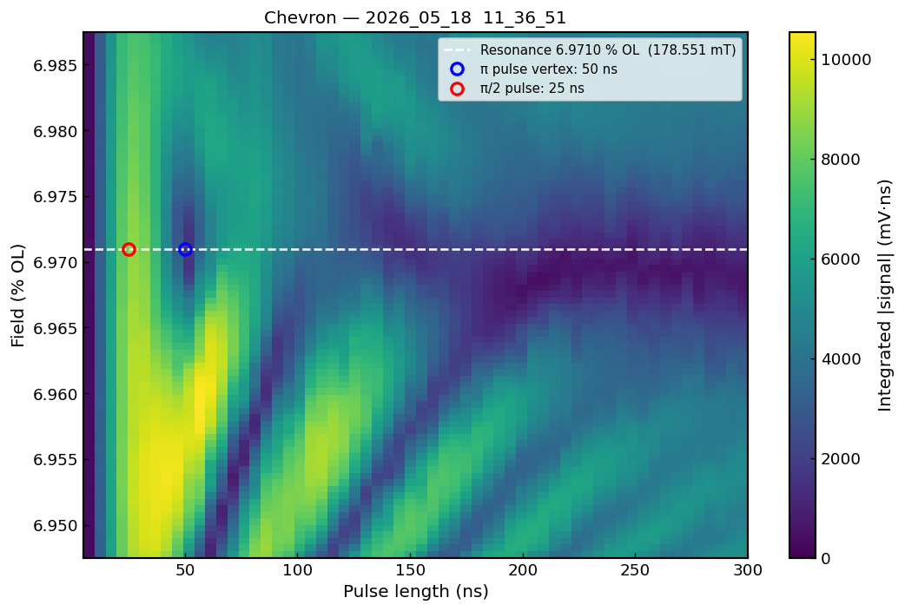
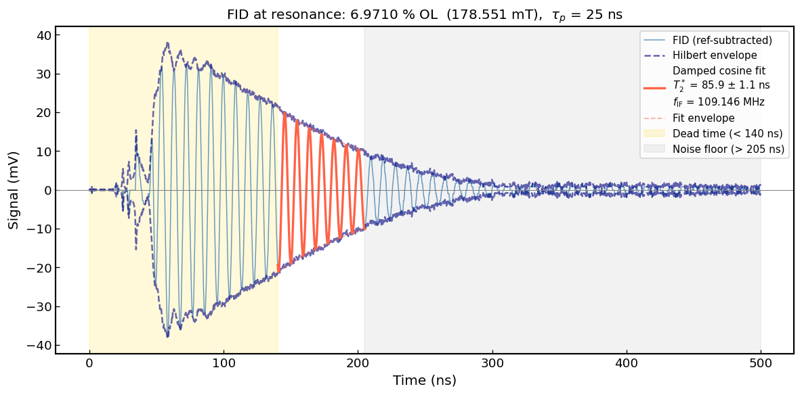
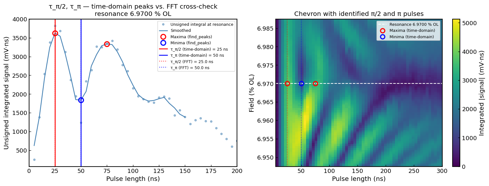
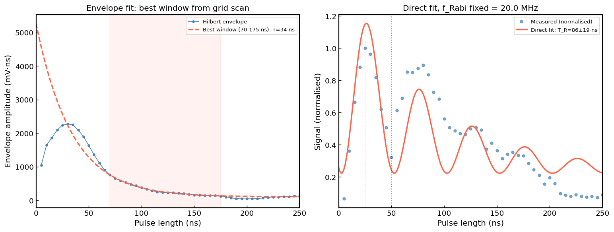
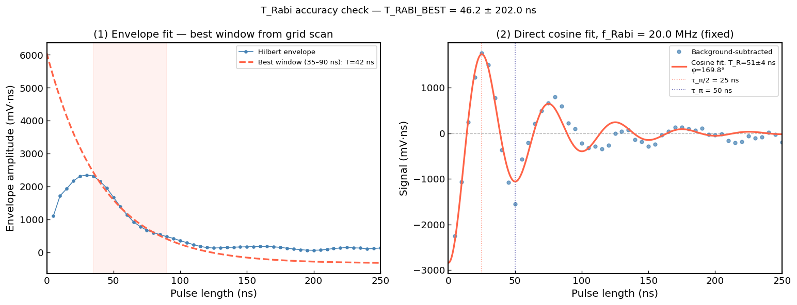
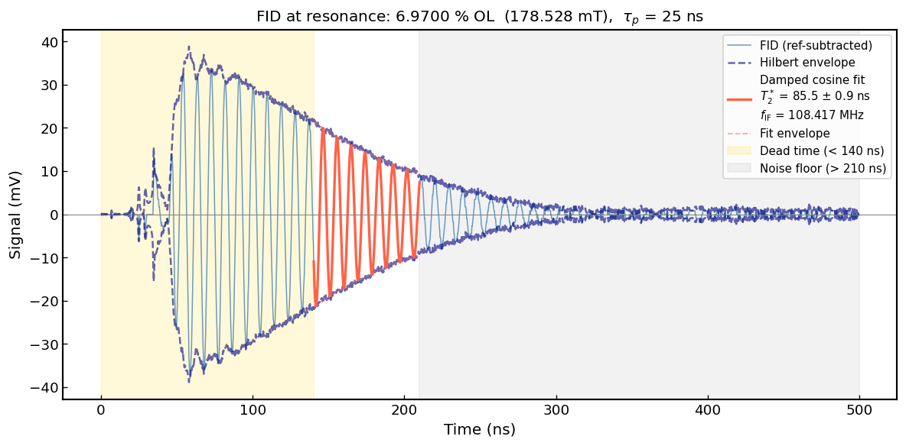
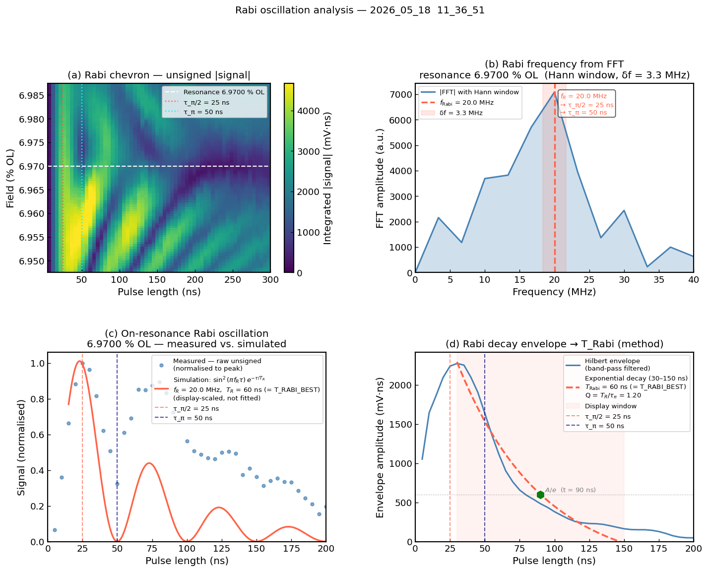
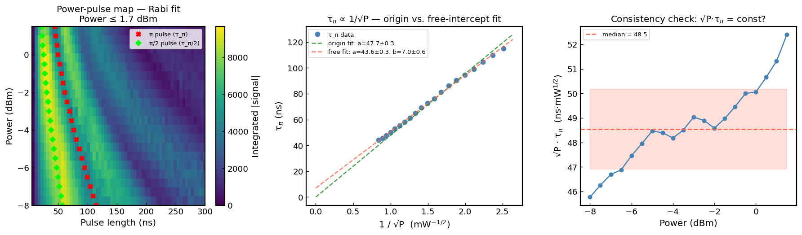
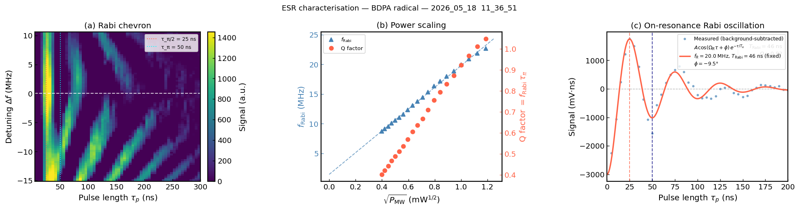

# Overview of analyses for chosen datasets and methods

1. Resonant field
2. $T_2^*$ (FID decay)
3. Rabi oscillations — $f_{\rm Rabi}$, π/π-2 calibration
4. $T_{\rm Rabi}$ (Rabi decay time)
5. Rabi chevron (2D map, measured vs. simulated)
6. Power scaling — $\tau_\pi \propto 1/\sqrt P$

### Datasets used

| Dataset | Sweep type | Used for |
| --- | --- | --- |
| `2026_05_18 · 11_36_51` | Field × pulse length | Resonant field (Sec. 2), $T_2^*$ (Sec. 3), Rabi oscillations & π/π-2 calibration (Sec. 4), Rabi chevron (Sec. 5) |
| `2026_05_17 · 11_57_29` | Power × pulse length | Power scaling, $\tau_\pi \propto 1/\sqrt P$ (Sec. 6) |
| Field-sweep dataset (CW, no pulse) | Field only | Attempted independent $T_2^*$ cross-check via field-sweep Lorentzian linewidth (Sec. 3.2) — failed |

---

### 1. Resonant field

- **Expected**: a single, clearly identifiable field value where the Rabi chevron vertex sits (fastest oscillation, shortest π-pulse).
- **Method**: visual identification from the chevron vertex; automated peak-finding on the field-integrated signal was attempted but failed
- **Result**: $B_0^{\rm res} = $  178.551 mT  (6.9710 % OL)

  

- **Weaknesses / open questions**: 
    * visual/manual step, not automated
    * no quoted uncertainty (neede?)
    * not cross-checked against a second dataset or day

### 2. $T_2^*$ (FID decay)

- **Expected**: single exponential decay of the FID envelope, $T_2^*$ on the order of tens to a few hundred ns given the linewidths typical of this setup.
- **Method (primary, time-domain)**: 
    * damped-cosine fit $s(t) = Ae^{-(t-t_0)/T_2^*}\cos(2\pi f_{\rm IF}(t-t_0)+\phi)+C$ 
    * DC offset estimated from the noise-only tail 
    * Hilbert envelope used for initial guesses
    * Fit window chosen via a 2D grid scan over (start, end), selecting the window that minimises residual RMS while keeping $T_2^*$ within 5 ns of the all-window median.

    Result: 

    

    
    

    - T2* (time domain) = 85.87 ± 1.06 ns
    - f_IF              = 109.1464 MHz
    - Amplitude         = 21.203 mV

- **Method (cross-check, FFT linewidth)**: 
    * Lorentzian fit to the FFT magnitude spectrum, $T_2^* = 1/(\pi\,\Delta f_{\rm FWHM})$
    * also attempted using the longest available pulse (300 ns) and via the field-sweep lineshape instead of the time-domain FID.

    Result: 

    * Theoretically:  $|\hat s(f)| \propto \frac{1}{\sqrt{1+(2\pi T_2^*)^2(f-f_{\rm IF})^2}} \quad\Rightarrow\quad T_2^* = \frac{1}{\pi\,\Delta f_{\rm FWHM}}$

    *  **Fails here** — resolution, not fitting, is the problem: $\delta f = \frac{1}{T_{\rm window}} \approx \frac{1}{300\,{\rm ns}} \approx 3.3\,{\rm MHz} \quad\sim\quad \Delta f_{\rm FWHM} \approx 3.5\,{\rm MHz}$

    *  $\delta f \sim \Delta f_{\rm FWHM}$ → nothing left to resolve. Zero-padding smooths the peak but adds no real resolution.
        *  Can't just extend the window: FID decays into noise at a $T_2^*$-dependent time — the quantity we want *is* the limit on the data we have.
        *  Confirmed by scanning the fit window below: $T_2^*$ swings wildly window-to-window; $f_{\rm IF}$ (peak position, not width) stays stable.

        

        
        

    * Flat line expected, downward trend seen: a reliable method would give the same $T_2^*$ regardless of where the window starts but instead it drifts steadily from ~28 ns to ~17 ns, the signature of a structurally questionable method, not noise.
    * Why it drifts: later start → shorter window → worse resolution ($\delta f\sim1/T_{\rm window}$) → artificially broadened peak → smaller fitted $T_2^*$, all sitting 3–5× below the trusted time-domain value (85 ns, dashed line).

- **Result**: $T_2^* = $  **85.87 ± 1.06 ns** (time-domain, primary) — FFT and field-sweep cross-checks **failed** (resolution-limited; see Sec. 3.2 for the diagnosis)
- **Weaknesses / open questions**: 
    * only one cross-check method (time-domain) actually works for this dataset
    * the FFT and field-sweep failures are explained by frequency resolution but not independently fixed/verified by another method
    * window-scan systematic uncertainty has not been propagated into later sections that use $T_2^*$ as a sanity bound (e.g. $T_{\rm Rabi}\le T_2^*$).

---

### 3. Rabi oscillations — $f_{\rm Rabi}$, π/π-2 calibration

- **Expected**:
    - On resonance, $B_1$ exerts a constant torque on the magnetisation → it precesses about $B_1$ at rate $\Omega_R = \gamma_e B_1$, --> a longer pulse =  more rotation: tip angle $\theta = \Omega_R\tau_p$, growing linearly with pulse length.
    - Detectable transverse component: $|M_\perp| = M_0\,|\sin(\Omega_R \tau_p)|$. Unsigned, background-subtracted detection effectively measures $|M_\perp|^2 \propto \sin^2(\Omega_R\tau_p)$  --> sweeping $\tau_p$ traces $\sin^2$ curve
    - $f_{\rm Rabi} = \Omega_R/2\pi \propto B_1$: the precession rate is set directly by the drive field strength ($\gamma_e$ fixed), so a stronger drive simply spins the magnetisation faster — no separate mechanism needed. (Same reason $f_{\rm Rabi}\propto\sqrt P$ later, since $B_1\propto\sqrt P$ — see Section 6.)
    - π/2 and π pulse lengths follow directly from $f_{\rm Rabi}$, as the first maximum and first zero of $\sin^2$ ($\theta=\pi/2$: fully in detection plane; $\theta=\pi$: flipped, nothing transverse left): $\tau_{\pi/2} = \frac{1}{2f_{\rm Rabi}} \qquad \tau_\pi = \frac{1}{f_{\rm Rabi}} = T_{\rm period}$

- **Method**:
    * background subtraction via moving-average high-pass filter (`SMOOTH_WIDTH=12` pts = 60 ns, must stay below one Rabi period)
    * $f_{\rm Rabi}$ from the FFT peak of the background-subtracted signal
    * π/π-2 found independently via time-domain (primary) and cross-checked against the FFT-derived analytic values
    * **Fit model for the on-resonance signal**: after background subtraction the constant offset $\tfrac{1}{2}$ is removed from $\sin^2(\Omega_R\tau)=\tfrac{1}{2}(1-\cos(2\Omega_R\tau))$, leaving a signal that oscillates around zero:

$$S_{\rm hpf}(\tau) = A\cos(\Omega_R\tau + \phi)\,e^{-\tau/T_R}$$

A damped **cosine** (not sin²) is therefore the correct model for the background-subtracted signal — it crosses zero and goes negative at every π pulse, which a sin² (always positive) cannot do. $f_R$ and $T_R$ are fixed from the FFT and `T_RABI_BEST` respectively; only $A$ and $\phi$ are fit.

- **Result**: **$f_{\rm Rabi} = $ 20 MHz, $\tau_{\pi/2} = $ 25 ns, $\tau_\pi = $ 50 ns**

  FFT cross-check: f_Rabi = 20.0 MHz (δf = 3.3 MHz, resolution-limited — same issue as the T2* linewidth method in 3.2)
  Methods agree within the 5 ns measurement grid spacing.

    

    
    

        

- **Weaknesses / open questions**: 
    * signed-signal cross-check is noisier/choppier and not used quantitatively
    * background-subtraction smoothing width is close to the Rabi period itself (borderline for the high-pass filter assumption)
    * resonance and pulse calibration both rely on the single dataset above.

---

### 4. $T_{\rm Rabi}$ (Rabi decay time)

- **Expected**: $T_{\rm Rabi}\le T_2^*$, since Rabi decay includes additional dephasing from $B_1$ inhomogeneity on top of the $T_2^*$ dephasing already present in the FID.

- **Method**: 
    * Hilbert envelope of the band-pass-filtered on-resonance signal, fit to a single exponential over a 2D grid of candidate (start, end) windows (same approach as the $T_2^*$ window scan)
    * best window chosen by minimum residual among windows within 5 ns of the grid median
    * Cross-checked against an independent direct fit of the **background-subtracted** signal to a damped cosine with $f_{\rm Rabi}$ fixed:

$$S_{\rm hpf}(\tau) = A\cos(\Omega_R\tau + \phi)\,e^{-\tau/T_R}$$

The cosine model is used here for the same reason as in Section 3: background subtraction removes the constant offset, leaving a signal that oscillates around zero. $T_R$ is the single free decay parameter here (unlike Section 3 where it was fixed); only after combining both estimates is `T_RABI_BEST` set and fixed everywhere downstream.

- **Result**: $T_{\rm Rabi} =$ 46.2 ns

    **Method comparison to find T_BEST**    
    

    
    

    ── Best estimate 
    T_RABI_BEST = 46.2 ± 202.0 ns
    (envelope grid: 41.7 ns,  direct cosine fit: 50.7 ns)

    **Results with T_BEST**
    

    
    

   

        
- **Weaknesses / open questions**: 
    * Is it fair to combine the T_BEST just like that? !!Very high error but time consistent over window choice grid

---

### 5. Rabi chevron (2D map, measured vs. simulated)

- **Expected**:
    - Sweeping both $\tau_p$ and $B_0$ together should reveal a **Rabi chevron**: off resonance, the drive no longer aligns perfectly with the spin's precession axis, so the effective rotation rate increases with detuning rather than staying fixed at $\Omega_R$:

        $\tilde\Omega_R(B_0) = \sqrt{\Omega_R^2 + \Delta^2} \qquad \Delta = \gamma_e(B_0 - B_0^{\rm res})$

    *   A faster $\tilde\Omega_R$ means a shorter oscillation period --> fringes should bunch up tightly right at $B_0^{\rm res}$ (where $\Delta=0$, $\tilde\Omega_R$ is minimal) and stretch out further from resonance, producing the characteristic **V-shape** when plotted against pulse length and field together.
    * The vertex of that V is itself as consistency checkfor resonant field
    * Off resonance, only the resonant component of $B_1$ effectively drives the spins, so the oscillation amplitude itself should shrink with detuning, not just speed up --> chevron arms should visibly fade outward from the vertex, not just narrow.

- **Method**: 
    * simulated using $f_{\rm Rabi}$, $T_{\rm Rabi}$ (`T_RABI_BEST`), and $B_0^{\rm res}$ from the sections above (no fit to the chevron itself) 
    * overlaid as contours on the measured map
    * residual panel (measured − scaled simulation) for better comparison because fringes might not give a good visual 

- **Result**: 
    * qualitative agreement, after background subtraction fringes clearly visible, slightly different shape but good enough to proove that we observe a rabi chevron pattern with a correctly identified rabi frequency. 
    * residual RMS not very high on resonance

    

    
    

- **Weaknesses / open questions**: 
    * map decay time scaled by ×10 purely for visual clarity in the simulated panel, not a physical claim
    * possible diagonal drift/banding visible in the measured map not accounted for in the (purely field-and-pulse-dependent) simulation.

---

### 6. Power scaling — $\tau_\pi \propto 1/\sqrt P$

- **Expected**:
    - $B_1\propto\sqrt P$ (resonator field $\propto\sqrt{\text{power}}$) → $\Omega_R=\gamma_e B_1\propto\sqrt P$.
    - π-pulse condition $\Omega_R\tau_\pi=\pi$ → $\tau_\pi$ must shrink as $P$ grows:
    $\tau_\pi = \frac{a}{\sqrt P} \qquad\text{(through the origin)}$

    - cross-check on the extraction: $f_{\rm Rabi}$ vs. $\sqrt P$ should be linear through the origin 

- **Method**:
    - $\tau_\pi$ via a per-power-row damped $\cos$ **fit**, no peak-finder since more robust, especially at low power where few points cover one period.
    - **Sequential seeding**: each row seeded with the *previous* (higher-power) row's fitted $f_R$. A single fixed guess fails becuase  $f_{\rm Rabi}$ varies severalfold across the range, and a bad guess can lock the fit onto the wrong period. Since $f_{\rm Rabi}$ varies smoothly, each neighbour is a good seed.
    - Both **origin-forced** ($\tau_\pi=a/\sqrt P$) and **free-intercept** ($\tau_\pi=a/\sqrt P+b$) fits run, so a real offset shows up as nonzero $b$ instead of being hidden.
    - $f_{\rm Rabi}$ vs. $\sqrt P$ checked independently as a cross-check.

- **Result**: origin fit $a = $ 47.7 ± 0.3, free fit $a = $ 43.6 ± 0.3, $b = $ (7.0 ± 0.6) ns

    

    
    

     

    
    

    * Clear linear dependency, however a not entirely const over power sweep

- **Weaknesses / open questions**: 
    * the nonzero intercept's physical origin (fixed timing offset vs. some other systematic) is inferred from the shape of $f_{\rm Rabi}$ vs. $\sqrt P$, not directly/independently measured
    * only one dataset analysed, no repeat at a different day/power range to confirm the intercept is reproducible.
    * Maybe different resonant field since measurement was done on different date

---
### Summary 

---
### General open questions

- Resonant field set on eye, $T_2^*$, $f_{\rm Rabi}$, and π/π-2 calibration are all anchored to one chosen dataset
- cross-dataset reproducibility untested because this was already the best dataset available
- No uncertainty is propagation yet from $B_0^{\rm res}$ or $T_2^*$ into quantities computed downstream of them.
- T_Rabi important at all?
- How sensitive is T2* on different resonant fields?

---
### References
- https://www.nature.com/articles/s41467-025-63241-4#Sec10 (Supplementary Info: https://static-content.springer.com/esm/art%3A10.1038%2Fs41467-025-63241-4/MediaObjects/41467_2025_63241_MOESM1_ESM.pdf) 
-
